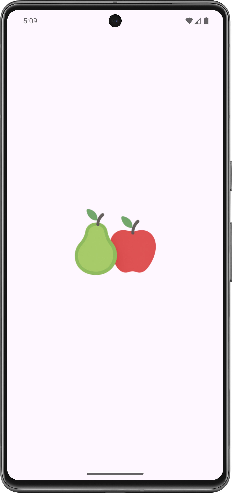
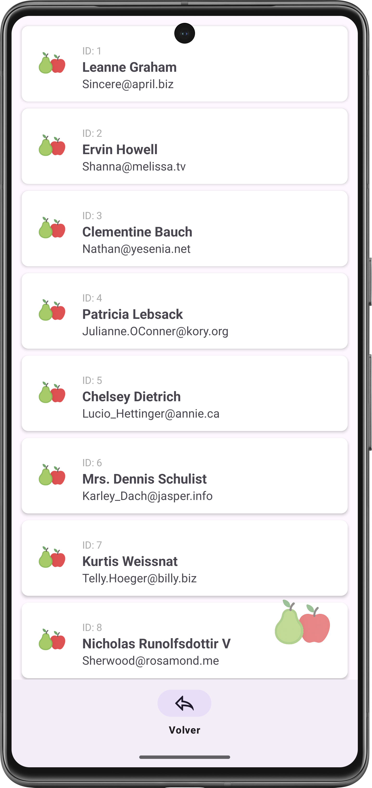
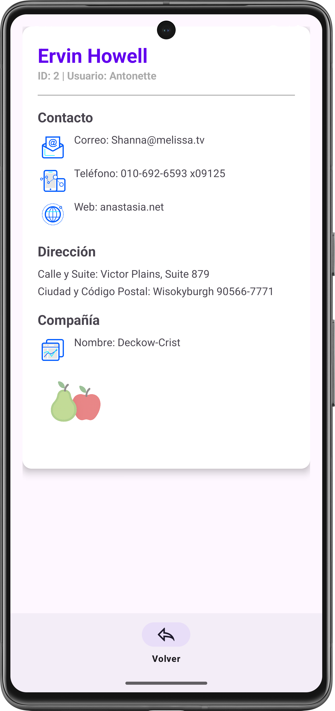
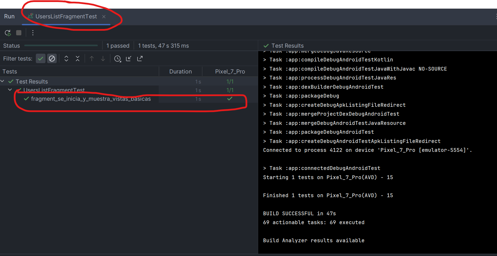
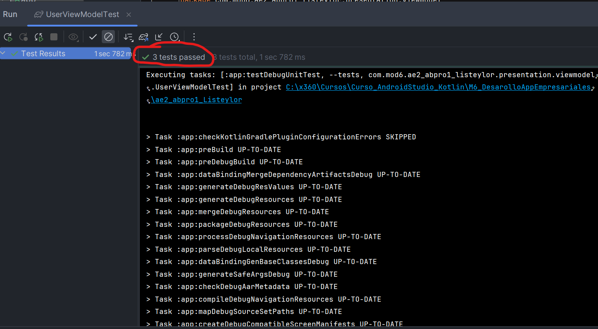
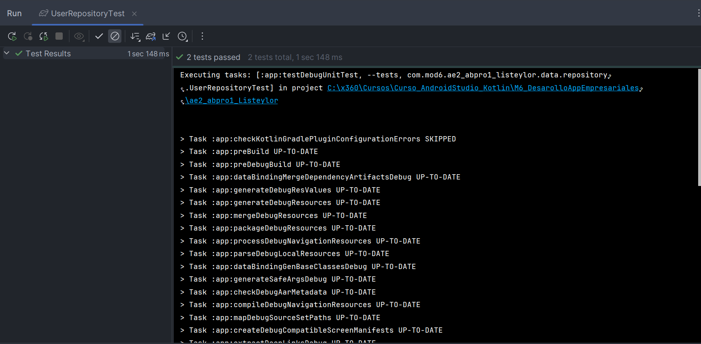

# 🚀 MOD6 AE2-ABPRO1 + AE3-ABP1: Sistema de Consultas de Personal "Listeylor" (MVVM + ApiRest + Retrofit + Testing )

<p float="center">
  
</p>

Aplicación nativa para Android, desarrollada en Kotlin, diseñada para funcionar como una herramienta de consulta de datos de personal remoto. La aplicación se conecta a una API REST para obtener un listado de usuarios con datos mínimos y, luego de seleccionar alguno, mostrar sus detalles completos. La arquitectura se basa en el patrón Model-View-ViewModel (MVVM), demostrando la integración de componentes de Android Jetpack para crear una aplicación robusta, escalable y reactiva.

---

## 🎯 Requerimientos de Funcionalidad y su Implementación

| Requerimiento                        | Implementación en V5                                                                                                                                                                     |
| ------------------------------------ | ---------------------------------------------------------------------------------------------------------------------------------------------------------------------------------------- |
| 1. Carga de Datos Remotos            | La aplicación utiliza**Retrofit** para consumir una API REST y descargar la lista de objetos User.                                                                                       |
| 2. Pantalla de Bienvenida (Splash)   | Se implementa una pantalla inicial (`SplashFragment`) sin `ActionBar` ni `BottomNavigationView` para una entrada limpia.                                                                 |
| 3. Lista de Usuarios (User List)     | Muestra una lista navegable (`RecyclerView`) de usuarios con datos básicos: **ID, Nombre y Email**.                                                                                      |
| 4. Detalle Completo de Usuario       | Al seleccionar un elemento de la lista, se navega a (`UserDetailFragment`) para mostrar TODOS los campos del objeto **User**, incluyendo sus estructuras anidadas (`address, company`).  |
| 5. Navegación Segura y Control de UI | Se utiliza**Navigation Component** con **Safe Args** para pasar objetos User serializables (Parcelable) entre Fragments. La BottomNavigationView y ActionBar se gestionan dinámicamente. |

---

## 🧠 Arquitectura y Tecnología: MVVM y Jetpack

Se implementa el patrón MVVM (Model-View-ViewModel) para garantizar una arquitectura limpia y se utilizan componentes de Android Jetpack para la estructura y reactividad.

1. | Modelo (`Model`) y Acceso a Datos (`Retrofit`)    | Componente                                                                                                                                                                      | Descripción |
   | ------------------------------------------------- | ------------------------------------------------------------------------------------------------------------------------------------------------------------------------------- | ----------- |
   | Modelo de Datos (User.kt, Address.kt, Company.kt) | Clases de datos definidas para mapear la respuesta JSON de la API. Se implementa Parcelable en todas ellas para permitir el paso seguro de objetos entre Fragments (Safe Args). |
   | API Service (ApiService.kt)                       | Interfaz de Retrofit que define los endpoints de la API, usando funciones suspend de Coroutines.                                                                                |
   | Repositorio (UserRepository.kt)                   | Centraliza el acceso a los datos (ApiService), encapsulando la lógica de la red. Ejecuta llamadas de I/O dentro de funciones suspend (Kotlin Coroutines).                       |
2. ViewModel (`UserViewModel.kt`)

- Hereda de `ViewModel`.
- Utiliza `viewModelScope.launch` para ejecutar las operaciones del **Repository** de forma asíncrona (I/O).
- **Gestión de Estado** : Contiene la lógica para la carga de datos inicial y el manejo de los estados de la petición (Cargando, Éxito, Error).
- Expone el estado de la aplicación a la Vista a través de **`LiveData`** o **`StateFlow`** :

  - `userList`: Lista de `User` que alimenta el `RecyclerView` de forma reactiva.
  - `loadingState`: Estado booleano para gestionar la visibilidad de barras de progreso.
  -

3. Vista (View) - Fragments y Activity

- **`MainActivity.kt`** : Actúa como host de la aplicación, inicializando el `NavController` y orquestando la visibilidad global de la UI (`ActionBar` y `BottomNavigationView`).
- **Fragments** (`SplashFragment`, `UsersListFragment`, `UserDetailFragment`):

  - Observan `LiveData` del `UserViewModel` para actualizar la UI.
  - Gestionan la navegación.
  - Utilizan **View Binding** para el acceso seguro a las vistas (eliminando `findViewById`).
  - **Gestión de UI** : Controlan la visibilidad de la `BottomNavigationView` mediante llamadas a funciones públicas de `MainActivity`.

---

## ✨ Reactividad y Flujo de Datos (API REST)

El flujo de datos está diseñado para ser completamente reactivo, centrado en la obtención y visualización de datos remotos mediante **Retrofit** y **Coroutines** .

1. **Disparo de la Solicitud:** En el `UsersListFragment`, el **`UserViewModel`** invoca una función `suspend` en el **`UserRepository`** para obtener la lista de usuarios.
2. **Ejecución Asíncrona (Coroutines):** El **`ViewModel`** utiliza `viewModelScope.launch` para ejecutar la llamada a la API fuera del hilo principal, garantizando que la UI no se bloquee.
3. **Mapeo y Almacenamiento:** Retrofit descarga el JSON y lo mapea a la estructura de objetos `User` del modelo.
4. **Actualización de LiveData:** El **`ViewModel`** actualiza su **`userList: LiveData<List<User>>`** con los datos recibidos (o el estado de error/carga).
5. **Sincronización de UI:** El observador en el **`UsersListFragment`** detecta automáticamente el cambio en `userList` y actualiza el **`RecyclerView`** con los nuevos datos, manteniendo la UI reactiva y actualizada.

---

## 🛠️ Tecnologías usadas

- **IDE** : Android Studio
- **Plataforma** : Android Nativo
- **Lenguaje** : Kotlin (1.9.22)
- **Arquitectura** : MVVM (Model-View-ViewModel).
- **Conectividad** : Retrofit (para API REST)
- **Persistencia** : Room Database (SQL Abstraction).
- **Concurrencia** : Kotlin Coroutines y `viewModelScope` (Dispatchers.IO).
- **Navegación** : Navigation Component y Safe Args (Parcelable para argumentos)
- **UI/Reactividad** : LiveData (Reactividad) y View Binding.

---

## 🏗️ Funcionamiento de la Aplicación

El flujo de la aplicación se centra en la consulta y presentación de datos:

1. **Inicio (Splash)**: La aplicación comienza en el SplashFragment, donde se oculta toda la UI auxiliar para dar una bienvenida limpia.
2. **Carga de Datos**: Tras el Splash, el UsersListFragment pide al UserViewModel que inicie la llamada asíncrona a la API (vía Retrofit/Repository).
3. **Visualización de Lista**: Una vez que la lista de usuarios se recibe, el LiveData se actualiza y el RecyclerView muestra la lista (ID, Nombre, Email). La ActionBar y BottomNavigationView se hacen visibles.
4. **Consulta Detallada**: Al hacer clic en un usuario, Safe Args transfiere el objeto User completo al UserDetailFragment.
5. **Detalle Completo**: El UserDetailFragment utiliza el objeto User recibido para poblar todos los campos detallados (Dirección, Compañía, etc.) en un CardView.
6. **Navegación**: El botón "Atrás" de la ActionBar (gestionado por NavigationUI) y el botón "Atrás" en la BottomNavigationView permiten regresar a la lista de usuarios.

---

## 🧩 Estrategia de Testeo (Anexo AE3-ABP1 - Testing en Android)

Anexando los resultados del **_caso AE3-ABP1_**, se ha implementado una estrategia de testeo integral orientada a mantener comprobar funcionalidad, bajo acoplamiento y compatibilidad continua entre pruebas unitarias e instrumentadas, sin afectar el entorno de producción (sin romper el código).

1. Objetivos principales

- Asegurar la correcta funcionalidad de la capa de datos (repositorios y modelos).
- Validar el comportamiento del ViewModel con respecto a los diferentes estados del flujo (Loading, Success, Error).
- Verificar la integridad básica de la interfaz de usuario (UI) sin depender de servicios externos ni romper la ejecución normal del código de producción.
- Mantener independencia entre pruebas unitarias e instrumentadas para facilitar la depuración y el mantenimiento.

2. Tipos de pruebas

   i. Pruebas Unitarias

   - Ejecutan en la JVM local sin depender del entorno Android.
   - Evalúan la lógica del negocio en clases como UserRepository y UserViewModel.
   - Se apoyan en MockK para simular dependencias (UserService, UserRepository).
   - Usan reglas y herramientas auxiliares:
   - InstantTaskExecutorRule → fuerza la ejecución síncrona de LiveData.
   - TestDispatcherRule → reemplaza el Dispatchers.Main por un TestDispatcher.
   - getOrAwaitValue() → espera valores de LiveData de forma segura y sin bloqueos infinitos.
   - Muestreo del test:

```kotlin

fun `fetchUsers debe actualizar userList a NetworkResult_Success`() = runTest {
    coEvery { userRepository.getUsers() } returns NetworkResult.Success(mockUserList)
    viewModel.fetchUsers()
    val result = viewModel.userList.getOrAwaitValue()
    assertTrue(result is NetworkResult.Success)
}

```

    ii. Pruebas Instrumentadas

    - Ejecutadas en entorno Android emulado.

    - Validan que las vistas se inflen correctamente y que el fragmento inicialice sin errores.

    - Usan el FragmentScenario (launchFragmentInContainer) de androidx.fragment:fragment-testing.

    - Evitan dependencias con el backend, verificando únicamente el renderizado de la UI base.

    - Muestreo del test:

```kotlin

@Test
fun fragment_se_inicia_y_muestra_vistas_basicas() {
launchFragmentInContainer<UsersListFragment>(
themeResId = R.style.Theme_Ae2_abpro1_Listeylor
)
onView(withId(R.id.rv_users))
.check(matches(isDisplayed()))
}

```

3. Buenas prácticas aplicadas

   i. Independencia total entre ambientes de producción y pruebas.

   ii. No se sobreescriben versiones ni dependencias desde los archivos Gradle.

   iii. Mocks controlados (con MockK) para evitar efectos colaterales.

   iv. Sin uso de delays o Thread.sleep(), garantizando tiempos de ejecución estables.

   v. Reglas de entorno limpias (InstantTaskExecutorRule, TestDispatcherRule) que restauran el estado tras cada test.

   vi. Pueden ejecutarse múltiples veces sin producir resultados distintos.

---

## ⭐ Capturas de Pantalla

<table width="100%">
    <tr>
        <td align="center" width="33%">
            
        </td>
        <td align="center" width="33%">
            
        </td>
        <td align="center" width="33%">
            
        </td>
    </tr>
    <tr>
        <td align="center">App instalada</td>
        <td align="center">Al lanzar la App</td>
        <td align="center">Landing y bienvenida</td>
    </tr>
    <tr>
        <td align="center">
            
        </td>
        <td align="center">
            
        </td>
        <td align="center">
            
        </td>
    </tr>
    <tr>
        <td align="center">Lista de usurios con datos básicos, incluye placeholder para una futura fotografía (la api no la incluye)</td>
        <td align="center">Detalle de un usuario</td>
        <td align="center">Test clase UsersListFragment"</td>
    </tr>
    <tr>
        <td align="center">
            
        </td>
        <td align="center">
            
        </td>
        <td align="center">
            
        </td>
    </tr>
    <tr>
        <td align="center">Test UserViewModel</td>
        <td align="center">Test UserRepository</td>
        <td align="center">Otro desarrollo de "Peras con Manzanas"</td>
    </tr>
</table>

---

## 🔎 Guía de Ejecución del Proyecto

**Para ejecutar este proyecto en tu entorno de desarrollo, siga estos 'quick steps':**

    1.**Clonar el Repo:** Clona el proyecto en su máquina local.

    2.**Abrir en Android Studio:** Abra la carpeta del proyecto con Android Studio. El IDE detectará automáticamente la configuración de Gradle.

    3.**Sincronizar Gradle:** Haz clic en el botón "Sync Now" si Android Studio te lo solicita. Esto descargará todas las dependencias necesarias.

    4.**Ejecutar:** Conecta un dispositivo Android físico o inicia un emulador. Luego, haz clic en el botón "Run 'app'" (el ícono de la flecha verde) para desplegar la aplicación.

**Para ejecutar este proyecto en tu celular, sigue estos 'quick steps':**

    1.**Copiar la APK:** Copia la aplicación (APK) en tu celular.

    2.**Instalar:** Instala la aplicación, salta los avisos de advertencia, es normal si la aplicación no ha sido productivizada la plataforma de Android.

    3.**Abrir la App:** Haz doble clic en el ícono de _**Peras con Manzanas para abrir**_ "GesTarea V5".

    4.**Recorrer las opciones:** Cliquea en las opciones y podrás acceder al listado de eventos, editar cada evento, crear nuevos eventos, regresando a cualquier punto de la app.

---

## 🛑 Instalación y Configuración

a. **Clonar el repositorio:**

```bash

https://github.com/jcordovaj/ae2_abpro1_Listeylor.git

```

b. **Abrir el Proyecto en Android Studio:**

b.1. Abrir Android Studio.

b.2. En la pantalla de bienvenida, seleccionar **"Open an existing Android Studio project"** (Abrir un proyecto de Android Studio existente).

b.3. Navegar a la carpeta donde se clonó el repositorio y seleccionarla. Android Studio detectará automáticamente el proyecto de Gradle y comenzará a indexar los archivos.

c. **Sincronizar Gradle:**

c.1. Este es el paso más importante. Después de abrir el proyecto, Android Studio intentará sincronizar la configuración de Gradle. Esto significa que descargará todas las librerías, dependencias y plugins necesarios para construir la aplicación. Normalmente, una barra de progreso se mostrará en la parte inferior de la consola de Android Studio con un mensaje como **"Gradle Sync in progress"**.

c.2. Si no se inicia, o si el proceso falla, intente con el botón **"Sync Project with Gradle Files"** en la barra de herramientas. Es el icono con el **"elefante" de Gradle**. Eso forzará la sincronización.

c.3. Esperar que el proceso de sincronización termine. De haber errores, puede ser por problemas en la configuración de Android u otros conflictos, la aplicación debe descargar lo que requiera y poder ser ejecutada "AS-IS".

d. **Configurar el Dispositivo o Emulador:**

Para ejecutar la aplicación, se requiere un dispositivo Android, puedes usarse el emulador virtual o un dispositivo físico.

d.1. Emulador: En la barra de herramientas, haga click en el botón del "AVD Manager" (Android Virtual Device Manager), que es el icono de un teléfono móvil con el logo de Android. Desde ahí, puedes crear un nuevo emulador con la versión de Android que prefiera (Nota: Debe considerar que cada celular emulado, puede requerir más de 1GB de espacio en disco y recursos de memoria).

d.2. Dispositivo físico: Conecte su teléfono Android a la computadora con un cable USB (también puede ser por WI-FI). Asegúrese de que las **Opciones de desarrollador y la Depuración por USB** estén habilitadas en su dispositivo. Consulte a su fabricante para activar estas opciones.

e. **Ejecutar la aplicación:**

e.1. Seleccione el dispositivo o emulador deseado en la barra de herramientas del emulador.

e.2. Haga click en el botón "Run 'app'" (el triángulo verde en la parte superior, o vaya al menu "RUN") para iniciar la compilación y el despliegue de la aplicación, puede tardar algunos minutos, dependiendo de su computador.

e.3. Si todo ha sido configurado correctamente, la aplicación se instalará en el dispositivo y se iniciará automáticamente, mostrando la pantalla de inicio.

---

## 🎉 Contribuciones (Things-To-Do)

Se puede contribuir reportando problemas o con nuevas ideas, por favor respetar el estilo de programación y no subir código basura. Puede utilizar: forking del repositorio, crear pull requests, etc. Toda contribución es bienvenida.

---

## 🔹 Licencia

Proyecto con fines educativos.

---
